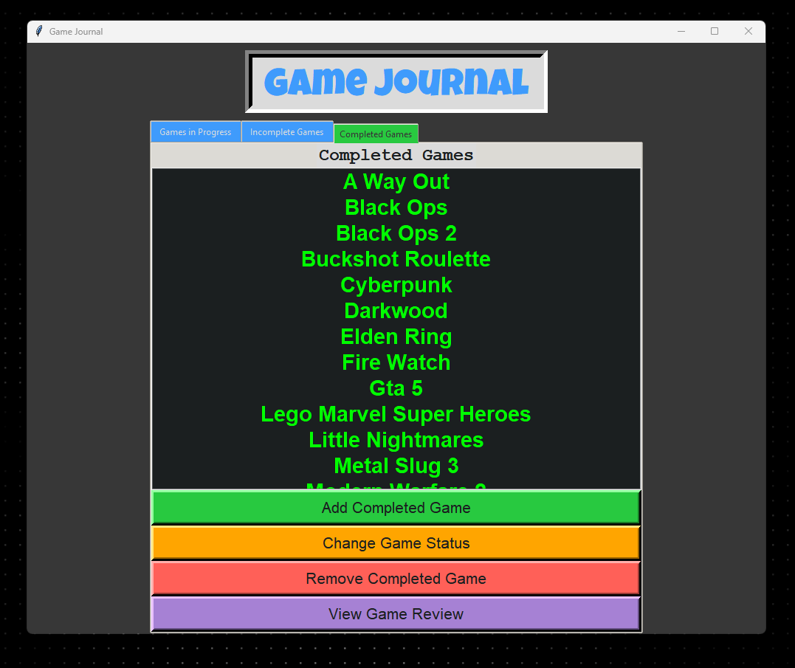
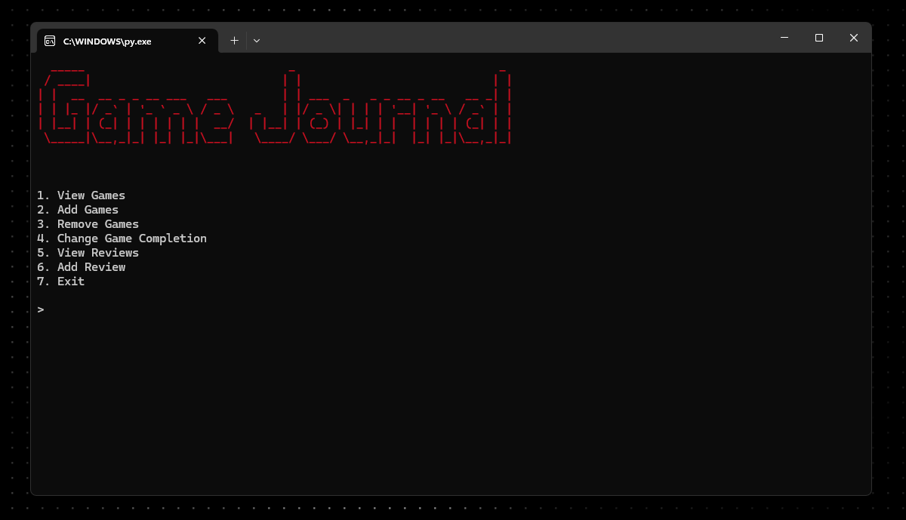

# GameJournal
## Tracking Your Games Better == Clearing Your Backlog
A simple Python application that allows you to track your video games, update their completion status, and leave reviews. The app uses a text-based user interface or a graphical user interface built with Tkinter, with data stored in a config.ini file.

### Features
- Track Games: Add games and categorize them as "In Progress", "Incomplete", or "Completed".
- Status Update: Change the status of the games as you progress through them.
- Reviews: Leave a review for each game you track.
- Time to Beat: See how long it takes to beat and 100% a game according to HowLongToBeat.com

### GUI

### TUI

